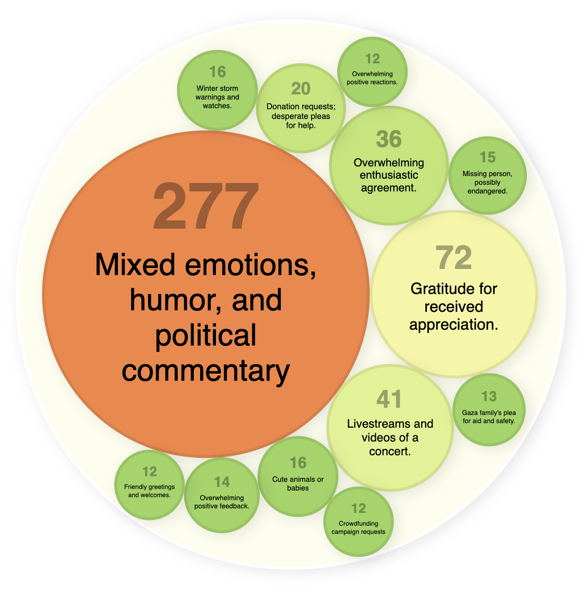

This project analyzes trends and topics on the [Bluesky](https://bsky.app/) social network
by clustering public posts and generating concise summaries using AI. 
It leverages Google Cloud [Vertex AI](cloud.google.com/vertex-ai) 
for [embedding](https://cloud.google.com/vertex-ai/generative-ai/docs/embeddings/get-text-embeddings) 
generation and the [Gemini](https://cloud.google.com/vertex-ai/generative-ai/docs/gemini-v2) model for summarization, 
and visualizes the results in an interactive bubble chart thanks to [D3.js](https://d3js.org/).

This project is developed in Java, and uses the [LangChain4j](https://docs.langchain4j.dev/) open source LLM orchestration framework.

You can read more about the inception of this project and how it works by reading the following article:  
[Analyzing trends and topics from Bluesky's Firehose with generative AI](https://glaforge.dev/posts/2025/01/06/analyzing-trends-and-topics-from-blueskys-firehose-with-generative-ai/)

Here's an example visualization the project generates:


## Setup and Usage

1. **Prerequisites:**
    - Java 21
    - Google Cloud Project with [Vertex AI enabled](https://cloud.google.com/vertex-ai/docs/start/cloud-environment)
    - Set the following environment variables:
        - `GCP_PROJECT_ID`: your Google Cloud project ID
        - `GCP_LOCATION`: the location of the region you want to run your model in (eg. `europe-west1`, `us-central1`...)
        - `GCP_VERTEXAI_ENDPOINT`: the endpoint for the embedding model (eg. `europe-west1-aiplatform.googleapis.com:443`)


2. **Build:**

```bash
./gradlew build
```

3. **Run:**

```bash
./gradlew run
```

By default, 10k messages are collected, which takes 4 or 5 minutes to gather.
Feel free to change the constants at the top of the `FirehoseConsumer` class to tweak the number of messages,
or how to handle the clustering hyperparameters.

4. **Visualize:**

Open the `static/index.html` file in your web browser, once the program has finished generating the data.

## Dependencies

- **D3.js**: For data visualization.
- **LangChain4j**: Java framework for LLMs.
- **Google Cloud Vertex AI**: For embeddings and summarization.
- **Apache Commons Math**: For clustering algorithms.
- **Gson**: For JSON processing.

## Contributing

See [`CONTRIBUTING.md`](CONTRIBUTING.md) for details.

No promise is made on accepting contributions, as I don't intend to maintain this project in the long run.

## License

Apache 2.0; see [`LICENSE`](LICENSE) for details.

## Disclaimer

This project is **not an official Google project**. It is not supported by
Google and Google specifically disclaims all warranties as to its quality,
merchantability, or fitness for a particular purpose.